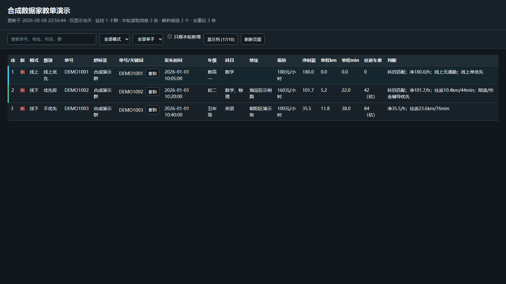

# WeFlow Tutor Monitor

[](https://github.com/fouchlenoria623-creator/weflow-tutor-monitor/actions/workflows/tests.yml)
[](LICENSE)

一个在 Windows 本地运行的家教群消息整理工具。它通过 WeFlow 的本地 HTTP API 只读获取你有权访问的群消息，拆分和去重家教单，按科目、时薪、通勤、线上优先级及个人条件排序，最后生成可搜索、可筛选、可点击列名排序的深色 HTML 报告。

本项目不会自动加好友、群发消息或替你投递。最终是否联系中介或家长，始终由使用者人工决定。

> [!IMPORTANT]
> WeFlow 当前官方仓库已经移除了旧有的密钥获取和数据库解密能力。实时监控只适用于你已经合法持有、自行配置的历史或兼容本地 API 快照；本项目不分发旧版、不提供解密或绕过指导，也不能保证当前上游版本兼容。纯合成演示和手动 Markdown 排名不依赖微信或 WeFlow。



## 工作流


## 主要功能

- 按群名正则或明确群 ID 选择监控范围
- 每小时或自定义间隔增量读取，不重复处理旧消息
- 从一条批量消息中拆出多个订单，识别单号或生成搜索关键词
- 合并跨群重复转发，保留来源群信息
- 识别线上单，并给线上单独立优先级
- 根据科目、年级、表面时薪、信息费、频次和通勤计算综合分
- 可选百度地图地理编码和驾车路线，估算单程距离、时间、车费及净时薪
- 按性别、院校、在职老师、住家、无法教授的科目等条件过滤
- 深色 HTML 报告支持搜索、模式/级别筛选、隐藏列、固定表头和点击表头排序
- Windows 计划任务按配置自动运行，互斥锁防止重复实例

## 使用边界

本仓库不包含 [WeFlow](https://github.com/hicccc77/WeFlow)、微信客户端、解密代码、密钥提取代码或任何真实聊天数据。实时模式需要你已经合法持有一个提供兼容本地 HTTP API 的历史或兼容快照，并遵守微信、WeFlow、家教群及所在地的规则。开发时曾在本机验证 WeFlow 5.1.0，但当前上游不再保证兼容。所需端点和字段见 [本地 API 兼容契约](docs/API_CONTRACT.md)。

消息里可能含未成年人信息、住址、联系方式和报价。报告默认只保存在本机，并已被 `.gitignore` 排除。完整要求见 [PRIVACY.md](PRIVACY.md)。

## 环境要求

- Windows 10 或 Windows 11
- Python 3.10 或更高版本，无第三方 Python 运行依赖
- 实时模式需要你已合法配置的兼容 WeFlow 本地 API；演示和手动 Markdown 模式不需要
- PowerShell 5.1 或更高版本
- Google Chrome；仓库脚本只用 Chrome 打开报告，不会回退到 Edge
- 百度地图 Web 服务 AK，可选；没有 AK 时仍可解析和排序，但新的线下地址不会计算实时路线

开发时验证过 Windows、Python 3.11 和 WeFlow 5.1.0。其他版本需要自行验证本地 API 的接口兼容性。

当前地址抽取、行政区识别和地图结果校验主要面向北京。其他城市可以使用群消息拆单、去重、线上排序和报告功能，但线下地址与通勤结果需要先补充当地规则并自行验证。出发地坐标必须是 **GCJ-02 经度,纬度**；不要直接填百度 BD-09 坐标。

## 快速开始

```powershell
git clone https://github.com/fouchlenoria623-creator/weflow-tutor-monitor.git
cd weflow-tutor-monitor
.\setup.ps1
notepad .\config.local.json
```

至少检查并按本人情况修改以下字段：

- `tutor_profile`：你的性别、院校标签和学校名
- `subject_weights`：越想接的科目分数越高
- `unsupported_subjects`：完全不接的科目，例如 `["化学"]`
- `include_name_patterns`：用于匹配群名的正则表达式
- `map_routing_enabled`：默认 `false`；只有确认允许地址外发后才改为 `true`
- `origin_name`、`origin_coord`：仅启用地图时必填，坐标使用 GCJ-02 经度,纬度

如果你已经合法配置好兼容 WeFlow 本地 API，先列出全部群聊到本地私有 CSV：

```powershell
.\check-setup.ps1 -ListGroups
```

结果写入 `state/group-catalog.csv`，该文件包含真实群名和群 ID，已被 Git 忽略。根据它调整 `include_name_patterns`、`include_group_ids` 和 `exclude_group_ids`，不要把文件贴到 issue 或提交到 GitHub。

然后检查配置和 API 结构：

```powershell
.\check-setup.ps1
```

检查结果只显示兼容状态和计数，不打印 token、群名、群 ID 或本机绝对路径。本项目强制 API 地址为 `127.0.0.1`、`localhost` 或其他 loopback 地址，避免把本地聊天接口暴露到局域网。

首次手动运行：

```powershell
.\run-monitor.ps1 -Force
```

报告生成在 `reports/latest.html`。使用 `.\open-report.ps1` 会明确调用 Google Chrome；找不到 Chrome 时会报错，不会交给系统默认浏览器或 Edge。点击“单程 km”“单程 min”“净时薪”等表头即可升降序排列；“单号/关键词”旁的按钮可以复制到微信搜索。

## 先看合成演示

合成数据不连接微信，也不需要本地配置：

```powershell
.\run-demo.ps1
```

结果位于 `demo-output/`，并由 Google Chrome 打开。演示复用正式 dashboard，包含筛选、隐藏列、复制关键词、固定表头和排序；群名、老师、地址、路线及订单号均为虚构内容，不会调用 WeFlow 或地图 API。

没有兼容 WeFlow 时，也可手动分析自己有权处理的 Markdown。输入格式可参考 `examples/synthetic_messages.md`：

```powershell
python .\ranker.py --input .\你的消息.md --date 2026-08-08 --out-dir .\work\manual-output --route-limit 0
```

该命令只处理显式提供的文件。输出仍含聊天正文，示例把它放在已被 Git 忽略的 `work/` 下；不要提交或分享真实结果。输出 HTML 是简化排名页；实时 dashboard 功能请以合成演示为准。手动模式的地图上限默认也是 `0`；只有显式设为正数并配置百度 AK 时才会发送地址。

## 非默认 WeFlow 配置

默认读取 `%APPDATA%\weflow\WeFlow-config.json`，并尝试从其中发现本机 API 地址和 token。便携版或非默认安装可设置以下用户级环境变量，设置后重新打开 PowerShell：

| 环境变量 | 作用 |
| --- | --- |
| `WEFLOW_CONFIG_PATH` | WeFlow 本地配置文件路径 |
| `WEFLOW_EXE_PATH` | 可选的 WeFlow 可执行文件路径 |
| `WEFLOW_API_BASE` | 本机 API 根地址，只接受 loopback HTTP |
| `WEFLOW_API_TOKEN` | Bearer token；敏感信息，禁止提交或截图 |
| `TUTOR_MONITOR_CONFIG` | 本项目本地配置路径 |
| `TUTOR_MONITOR_DATA_DIR` | 报告、状态和日志目录 |
| `CHROME_PATH` | 非标准安装位置的 `chrome.exe` 路径 |

例如仅覆盖 API 地址：

```powershell
[Environment]::SetEnvironmentVariable('WEFLOW_API_BASE', 'http://127.0.0.1:5031', 'User')
```

详细响应结构见 [API 兼容契约](docs/API_CONTRACT.md)。

## 地图通勤

地图功能默认关闭。只有同时把 `map_routing_enabled` 改为 `true` 并设置环境变量密钥，程序才会把订单中的线下地址发送给百度地图地理编码和驾车路线服务。地址可能包含家庭或学校位置；开启即代表你确认有权向该第三方服务发送这些地址。

```powershell
[Environment]::SetEnvironmentVariable('BAIDU_MAP_AK', '你的百度地图AK', 'User')
```

重新打开 PowerShell 后运行 `.\check-setup.ps1`。`route_limit_per_run` 限制的是**每轮新线下地址数**，不是 HTTP 请求次数；每个新地址通常产生 1 次地理编码和 1 次路线请求，缓存命中及线上单不再调用地图 API。地图返回失败或额度耗尽时，订单仍会保留，通勤和净时薪可能为空或明确标为估算。

## 自动运行

`active_hours` 和 `scan_interval_minutes` 是唯一的时间配置来源。例如默认从 10:00 到 21:59，每 60 分钟运行一次：

```powershell
.\install-task.ps1
Get-ScheduledTask -TaskName 'WeFlow Tutor Monitor'
```

每次修改 `active_hours` 或 `scan_interval_minutes` 后都要重新运行 `.\install-task.ps1`，以重建触发器。任务只在当前 Windows 用户保持登录、电脑可运行且兼容 WeFlow API 可访问时工作；锁屏不等于退出登录。

卸载计划任务：

```powershell
.\uninstall-task.ps1
```

计划任务最长运行 30 分钟，同一时间只允许一个实例。Python 的失败退出码会传给任务计划程序，日志统一写入 `logs/monitor.log`。

## 配置说明

| 字段 | 作用 |
| --- | --- |
| `active_hours` | 每日允许运行的起止小时 |
| `scan_interval_minutes` | 计划任务间隔，至少 15 分钟 |
| `first_run_lookback_hours` | 第一次运行回看多少小时 |
| `keep_leads_days` | 本地状态保留天数 |
| `map_routing_enabled` | 是否允许把新线下地址发给百度地图，默认 `false` |
| `route_limit_per_run` | 每轮地图新线下地址上限，不是 HTTP 次数 |
| `subject_weights` | 科目匹配的基础分 |
| `unsupported_subjects` | 命中后硬排除的科目 |
| `tutor_profile.gender` | `male`、`female` 或留空；留空时标记明确性别要求供人工复核，不自动硬排 |
| `tutor_profile.school_tags` | 如 `211`、`985`、`双一流` |
| `tutor_profile.school_names` | 可满足指定学校条件的正式或常用名称 |
| `athlete_profile` | 可选的体育/体能背景加分规则 |
| `online_priority_bonus` | 线上单额外加分 |
| `include_name_patterns` | 自动纳入群聊的群名正则 |
| `include_group_ids` | 明确纳入的群 ID，只写在本地配置 |
| `exclude_group_ids` | 明确排除的群 ID，只写在本地配置 |
| `notify_tiers` | 会触发桌面通知的级别 |
| `notification_include_address` | 是否在桌面通知中展示地址，默认 `false` |

运动背景配置示例：

```json
{
  "level": "你的运动员等级",
  "general_bonus": 25,
  "nearby_bonus": 8,
  "nearby_km": 5,
  "general_subjects": ["体育", "体能", "体测", "跳绳"],
  "specific_subjects": ["游泳", "轮滑", "足球", "篮球"]
}
```

## 排序方法

排序是启发式方法，不是录用概率模型。大致由以下部分组成：

1. 先拆分批量消息并按真实单号或结构化字段去重。
2. 对明确不符合的性别、院校、在职/专职、住家和不支持科目做硬排除。
3. 对科目、年级、合适频次、陪读/作业辅导、线上模式等加分。
4. 有地图结果时，用课时收入减去往返车费和分摊信息费，再除以上课加通勤总时长，得到净时薪。
5. 综合分映射为“优先投、可投、备选、不优先”；线上单显示独立的线上级别。

任何自然语言规则都可能误判。投递前务必展开完整消息，核对日期、老师条件、费用、信息费、地址和联系方式。

## 常见问题

**`未找到本地配置`**

运行 `.\setup.ps1`，再编辑 `config.local.json`。

**API 未启动或返回 401**

确认你合法持有的兼容 WeFlow 快照已经配置并启用本机 API，再检查上述环境变量。当前官方 WeFlow 不再保证提供旧 API；本项目不会指导恢复已移除的取密钥或解密能力。

**今天订单看起来过少**

先检查 `check-setup.ps1`、`include_name_patterns`、明确包含/排除的群 ID，以及 WeFlow 是否已完成最新消息收取。报告中的“本轮读取消息”并不等于微信群真实新增总量。

**地图字段为空**

确认 `map_routing_enabled=true`、GCJ-02 `origin_coord`、用户级 `BAIDU_MAP_AK` 和百度地图服务额度。地图不可用不会阻止无路线排序。

**报告打开到了 Edge 或找不到浏览器**

请运行 `.\open-report.ps1`。脚本只调用 Google Chrome；如 Chrome 安装在非标准位置，设置用户级 `CHROME_PATH`。它不会回退到 Edge。

**脚本被 PowerShell 拦截**

可在当前用户范围允许本地脚本：`Set-ExecutionPolicy -Scope CurrentUser RemoteSigned`。执行前请自行阅读脚本内容。

## 开发与测试

```powershell
python -m unittest discover -v -p 'test_*.py'
python -m compileall -q .
python .\tools\privacy_check.py
python .\demo.py --out-dir .\demo-output
```

提交代码前请使用纯合成数据。贡献说明见 [CONTRIBUTING.md](CONTRIBUTING.md)，安全问题见 [SECURITY.md](SECURITY.md)。

## 许可证与声明

本项目以 [MIT License](LICENSE) 发布。WeFlow 和微信是独立的第三方项目/产品，本项目与其开发者或运营方无隶属、背书或官方合作关系。
